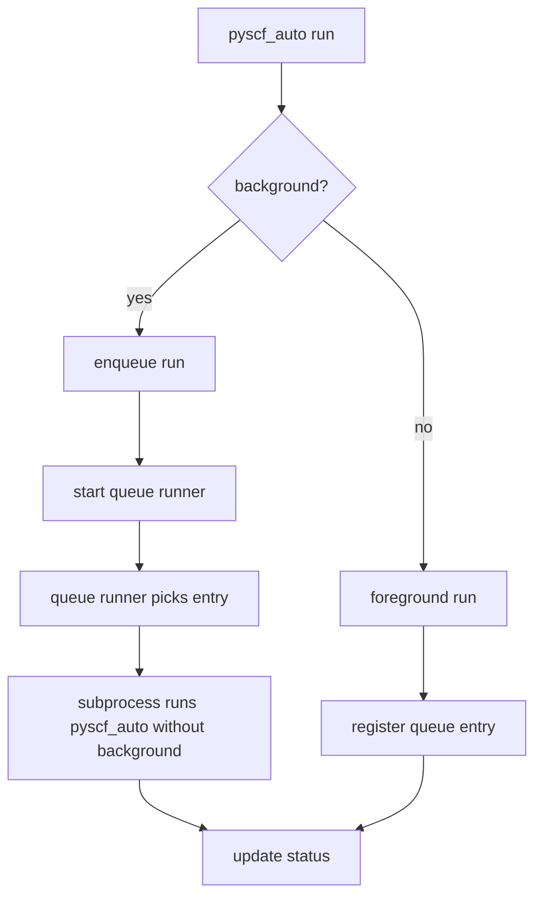
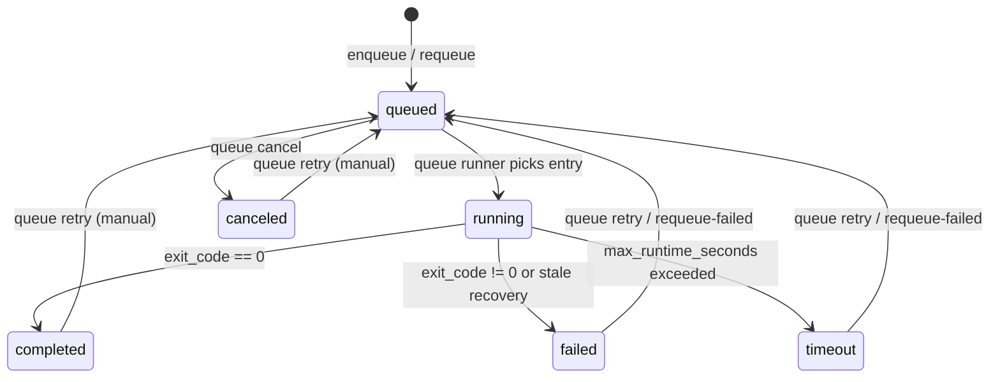

# Queue & Background Execution

## Basics

- Use `--background` to enqueue a run; the queue runner executes it.
- Foreground runs are also recorded for status tracking and show up in `pyscf_auto queue status`.

## Queue/Background Flow



## Status Transitions



## Common Commands

```bash
pyscf_auto run input.xyz --config run_config.yaml --background

pyscf_auto queue status
pyscf_auto queue cancel <RUN_ID>
pyscf_auto queue retry <RUN_ID>
pyscf_auto queue requeue-failed
pyscf_auto queue prune --keep-days 30
pyscf_auto queue archive
```

## Related Files

- Queue file: `~/pyscf_auto/runs/queue.json`
- Queue runner log: `~/pyscf_auto/log/queue_runner.log`
