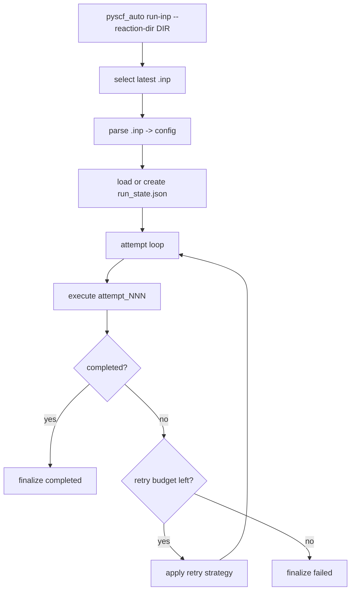

# Run Execution Model

`pyscf_auto` executes one reaction directory at a time with `run-inp`.
The newest `.inp` file in that directory is selected, parsed, and then executed
with automatic retry.

## Top-Level Flow

## Retry Behavior

- Total attempts = `1 + max_retries`
- `max_retries` default comes from app config: `runtime.default_max_retries`
- Retry patches are recorded per attempt in `run_state.json`

## Status Files

Each reaction directory stores:

- `run_state.json`: machine-readable state
- `run_report.json`: summarized result
- `run_report.md`: human-readable report

## Run Status Values

- `running`
- `retrying`
- `completed`
- `failed`
- `interrupted`
