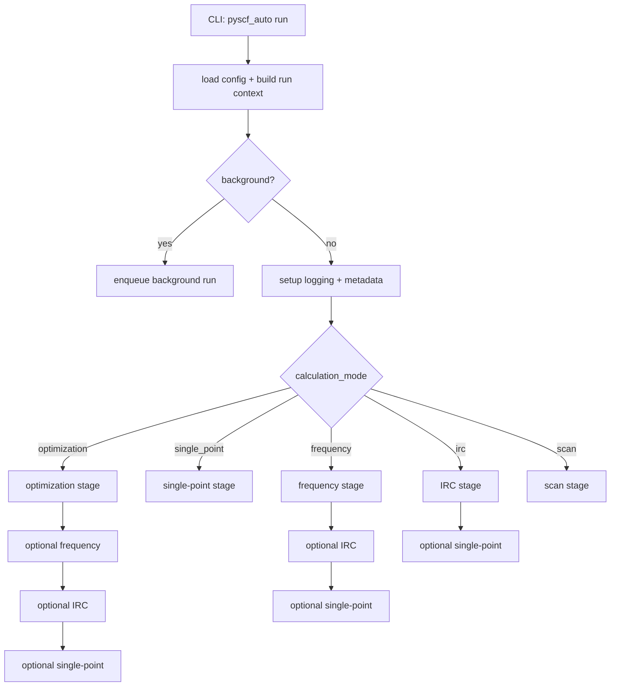
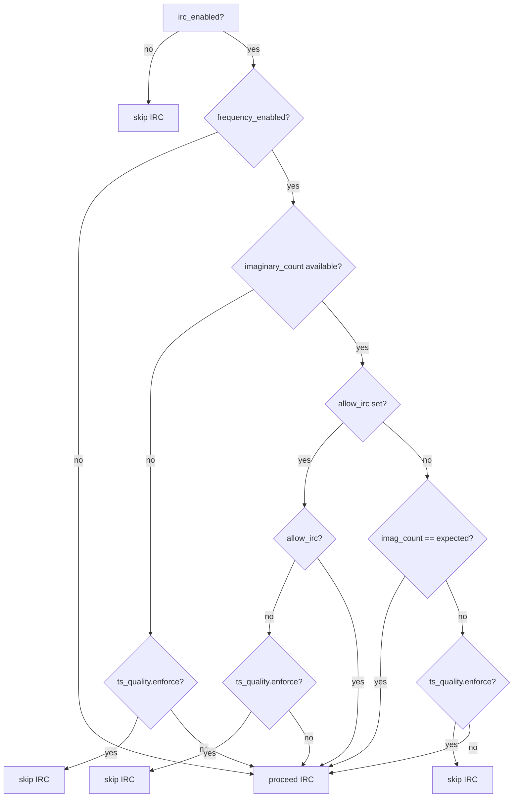
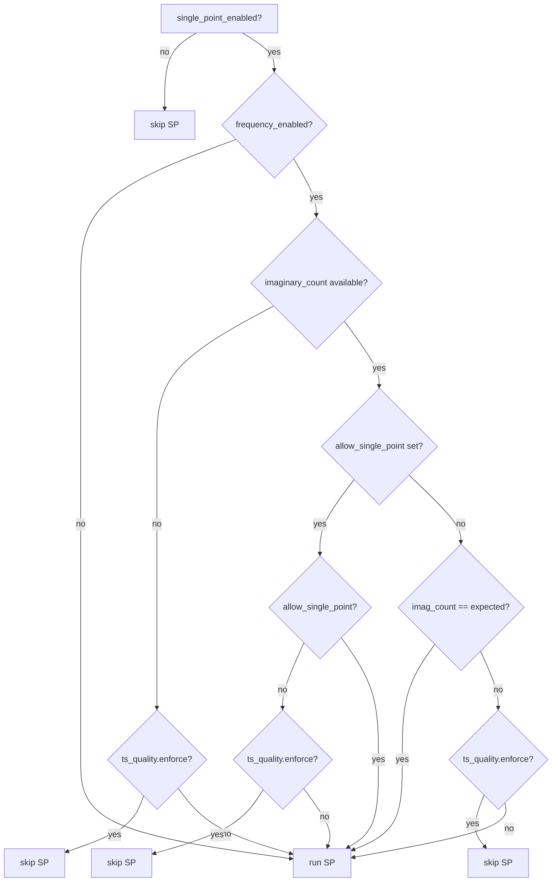

# Workflows

## Calculation Modes

- `optimization`: geometry optimization (optionally followed by frequency/IRC/single-point)
- `single_point`: single-point energy
- `frequency`: harmonic frequencies (Hessian)
- `irc`: IRC (imaginary mode + IRC)
- `scan`: 1D/2D scan

## Top-Level Flow

## Post-Optimization and Frequency Steps

- `frequency_enabled`: enable frequency after optimization.
- `irc_enabled`: enable IRC after optimization or frequency.
- `single_point_enabled`: enable single-point after optimization, frequency, or IRC.

With `calculation_mode: irc`, the optional single-point runs after IRC completes.

## TS Quality Gating

IRC and single-point execution are gated by imaginary count and TS quality checks.

- Expected imaginary count: 1 for TS optimization (`optimizer.mode: transition_state`), 0 otherwise.

### IRC gate

### Single-point gate

