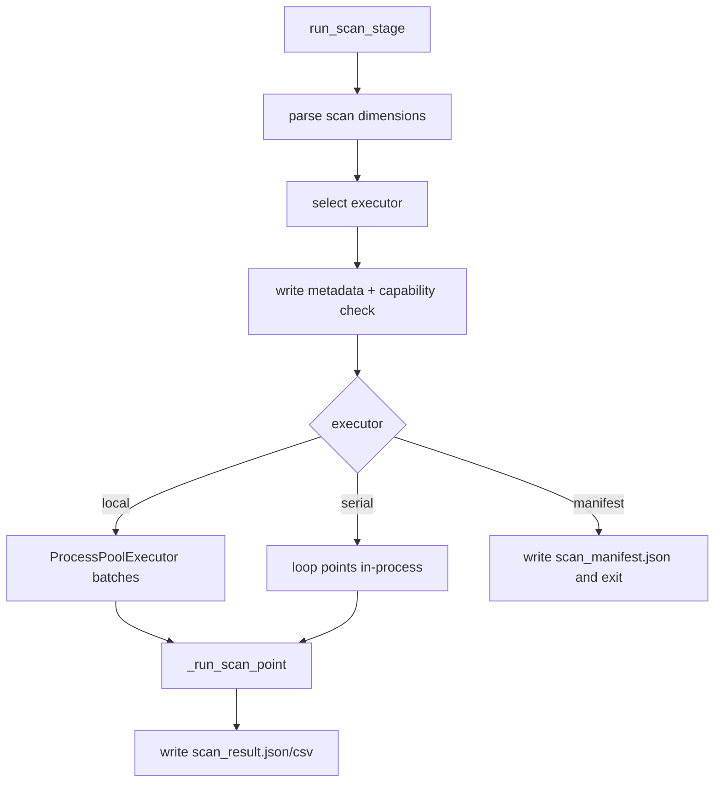
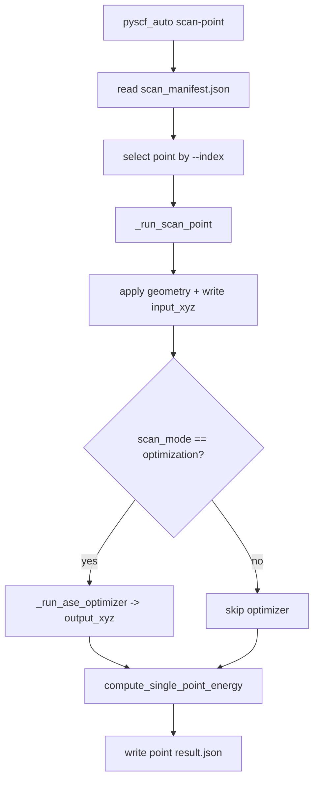

# 스캔

## 개요

- `calculation_mode: scan`일 때만 동작합니다.
- `scan.mode`는 `optimization` 또는 `single_point`만 지원합니다.
- `scan.executor` 기본값은 `local`(병렬)입니다.

## 실행 흐름



## scan-point 흐름



## scan 설정 예시

```yaml
calculation_mode: scan
scan:
  mode: optimization
  executor: local
  max_workers: 4
  threads_per_worker: 2
  batch_size: 10
  dimensions:
    - type: bond
      i: 0
      j: 1
      start: 1.0
      end: 1.4
      step: 0.2
```

## scan_manifest.json 예시

```json
{
  "schema_version": 1,
  "generated_at": "2026-01-03T10:01:04",
  "run_dir": "/Users/you/pyscf_auto/runs/2026-01-03_100104/0147_scan",
  "scan_dir": "/Users/you/pyscf_auto/runs/2026-01-03_100104/0147_scan/scan",
  "xyz_file": "/Users/you/work/input.xyz",
  "scan_mode": "single_point",
  "dimensions": [
    {
      "type": "bond",
      "indices": [0, 1],
      "start": 1.0,
      "end": 1.4,
      "step": 0.2
    }
  ],
  "executor": "manifest",
  "settings": {
    "basis": "def2-svp",
    "xc": "b3lyp",
    "scf_config": {"max_cycle": 50, "chkfile": "scf.chk"},
    "solvent": "water",
    "solvent_model": "pcm",
    "solvent_eps": 78.3553,
    "dispersion": "d3bj",
    "optimizer_mode": "minimum",
    "optimizer_ase": {"optimizer": "bfgs", "steps": 200, "fmax": 0.05},
    "charge": 0,
    "spin": 0,
    "multiplicity": 1,
    "memory_mb": 8000,
    "thread_count": 4,
    "threads_per_worker": 2,
    "write_interval_points": 5,
    "profiling_enabled": false
  },
  "points": [
    {
      "index": 0,
      "values": [1.0],
      "label": {"index": 0, "bond:0,1": 1.0},
      "work_dir": "/Users/you/.../scan/points/point_000",
      "input_xyz": "/Users/you/.../scan_000_input.xyz",
      "output_xyz": null,
      "result_file": "/Users/you/.../points/point_000/result.json"
    }
  ],
  "command_template": [
    "pyscf_auto",
    "scan-point",
    "--manifest",
    "/Users/you/.../scan_manifest.json",
    "--index",
    "{index}"
  ]
}
```

## 실행 팁

- `manifest` 모드는 매니페스트만 생성하고 종료합니다.
- 분산 환경에서 `pyscf_auto scan-point --manifest <path> --index <N>`으로 개별 포인트를 실행합니다.
