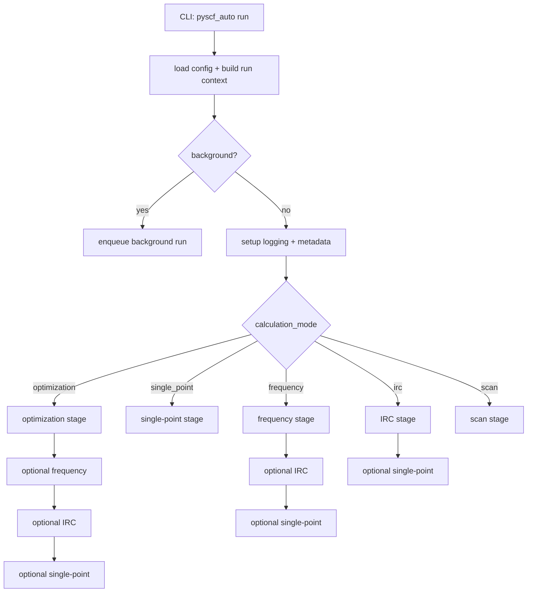
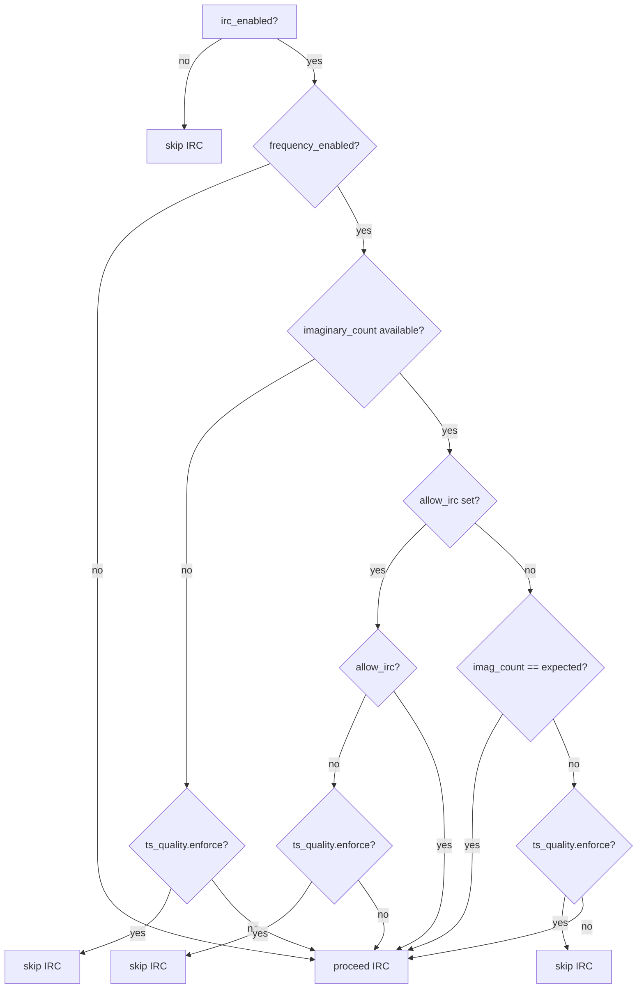
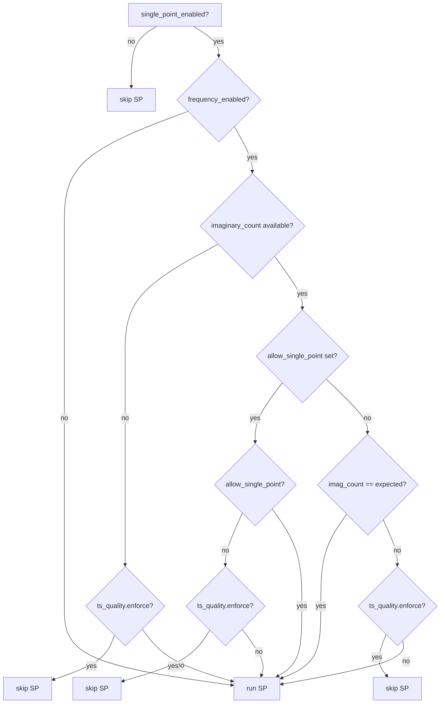

# 워크플로우

## 계산 모드

- `optimization`: 구조 최적화 (선택적으로 frequency/IRC/single-point를 이어서 실행)
- `single_point`: 단일점 에너지
- `frequency`: 진동수 (Hessian 포함)
- `irc`: IRC (가상 모드 계산 후 실행)
- `scan`: 1D/2D 스캔

## 전체 실행 흐름

## 최적화 및 주파수 후속 단계

- `frequency_enabled`: 최적화 후 진동수 계산 수행 여부.
- `irc_enabled`: 최적화 또는 주파수 후 IRC 실행 여부.
- `single_point_enabled`: 최적화/주파수/IRC 후 단일점 계산 수행 여부.

`calculation_mode: irc`에서는 IRC 완료 후 단일점 계산을 선택적으로 실행합니다.

## TS 품질(ts_quality) 게이트

주파수 결과의 imaginary count 및 TS 품질 검사 결과에 따라 IRC/단일점 실행이 자동으로 gating 됩니다.

- 기대 imaginary count: TS 최적화(`optimizer.mode: transition_state`)는 1, 일반 최소화는 0

### IRC gate

### Single-point gate

