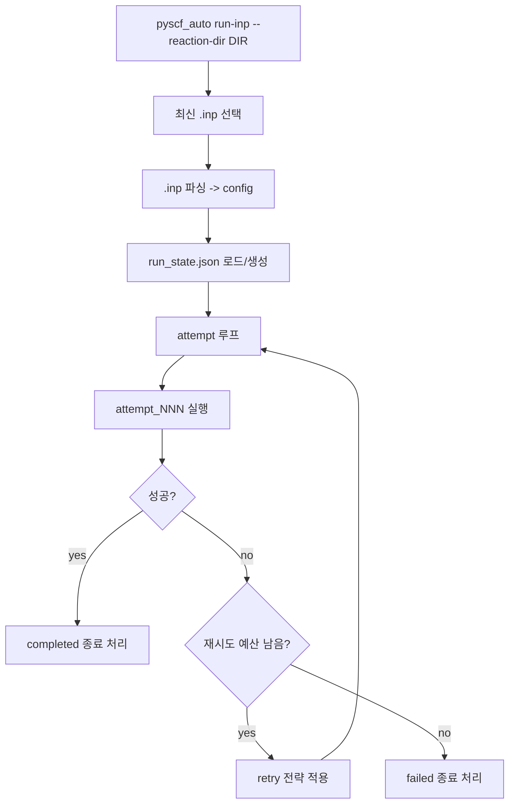

# 실행 모델

`pyscf_auto`는 `run-inp`로 반응 디렉터리 단위 계산을 수행합니다.
해당 디렉터리에서 가장 최신 `.inp` 파일을 선택해 파싱한 뒤,
자동 재시도 루프로 계산을 실행합니다.

## 상위 실행 흐름

## 재시도 동작

- 전체 시도 횟수 = `1 + max_retries`
- 기본 `max_retries`는 앱 설정 `runtime.default_max_retries`를 사용
- 각 시도에서 적용된 패치는 `run_state.json`에 기록

## 상태/리포트 파일

각 반응 디렉터리에 다음 파일이 생성됩니다.

- `run_state.json`: 상태 원본
- `run_report.json`: 요약 결과
- `run_report.md`: 사람이 읽기 쉬운 리포트

## 주요 상태 값

- `running`
- `retrying`
- `completed`
- `failed`
- `interrupted`
